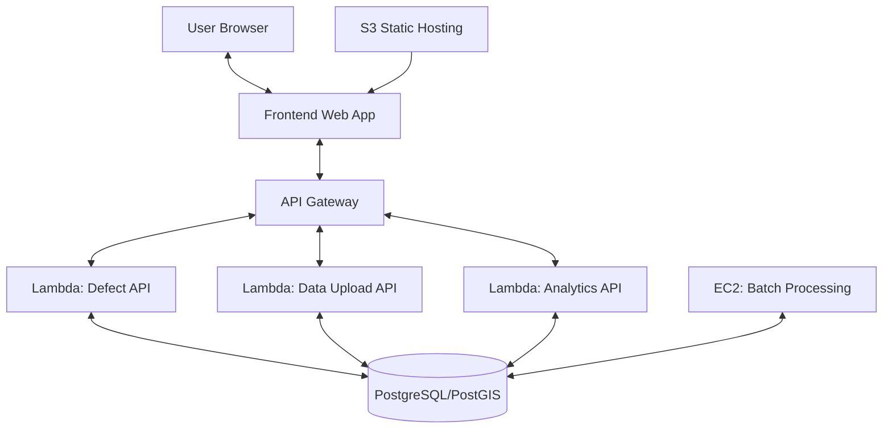

# Road Metrics AI: Architecture Diagram

## Architecture Overview

The Road Metrics AI platform follows a serverless microservices architecture with these key components:

### Client Layer
- **User Browser**: End users access the application through web browsers
- **Frontend Web App**: React-based SPA hosted on S3, implementing the user interface for map interaction, defect reporting, and analytics visualization

### API Layer
- **API Gateway**: Entry point for all API requests, handling routing, authentication, and rate limiting
- **Lambda Functions**:
  - **Defect API**: Handles CRUD operations for road defects
  - **Data Upload API**: Manages external data ingestion
  - **Analytics API**: Generates statistics and aggregated data

### Data Layer
- **PostgreSQL/PostGIS**: Relational database with geospatial extensions for storing defect data with location information
- **S3 Static Hosting**: Hosts the frontend assets and static files

### Processing Layer
- **EC2 Batch Processing**: Runs scheduled jobs for data aggregation, report generation, and maintenance tasks

## Deployment Flow

1. Frontend is built and deployed to S3
2. Backend code is packaged and deployed as Lambda functions
3. API Gateway is configured to route requests to the appropriate Lambda functions
4. Database migrations are applied to the PostgreSQL instance
5. EC2 instance is provisioned for batch processing jobs 