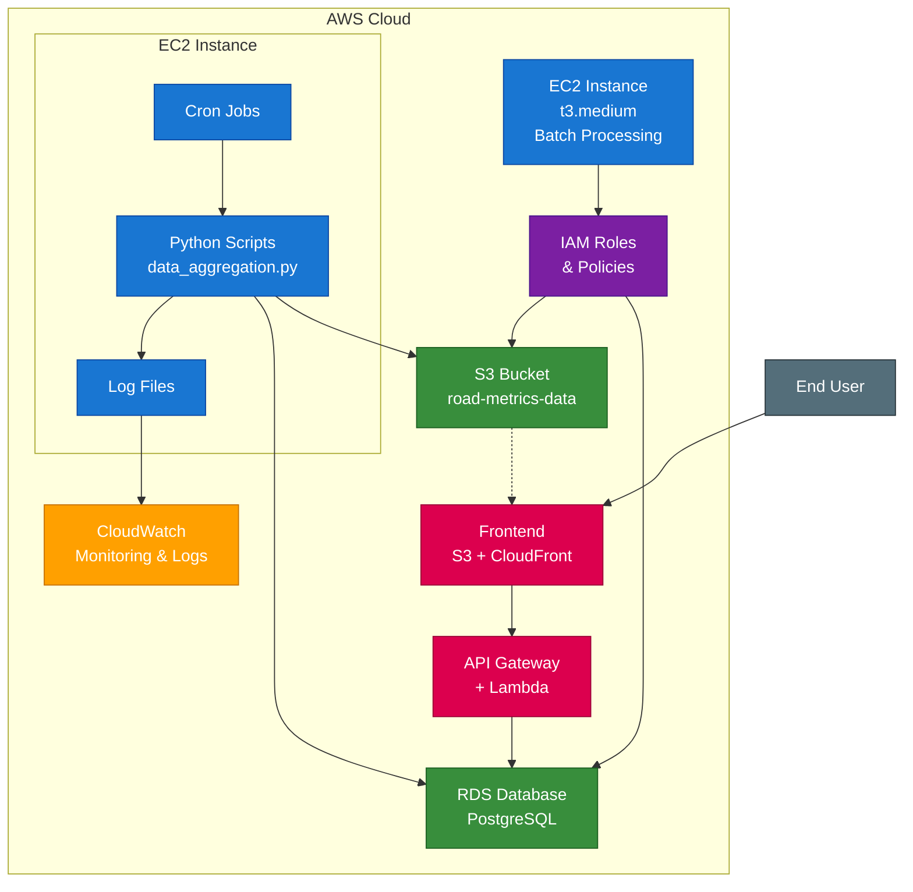

```mermaid
graph TD
    subgraph "AWS Cloud"
        EC2["EC2 Instance<br>t3.medium<br>Batch Processing"]
        S3["S3 Bucket<br>road-metrics-data"]
        RDS["RDS Database<br>PostgreSQL"]
        CW["CloudWatch<br>Monitoring & Logs"]
        IAM["IAM Roles<br>& Policies"]
        
        subgraph "EC2 Instance"
            CRON["Cron Jobs"]
            SCRIPT["Python Scripts<br>data_aggregation.py"]
            LOG["Log Files"]
        end
        
        API["API Gateway<br>+ Lambda"]
        FRONT["Frontend<br>S3 + CloudFront"]
    end
    
    USER["End User"]
    
    CRON --> SCRIPT
    SCRIPT --> LOG
    LOG --> CW
    
    SCRIPT --> RDS
    SCRIPT --> S3
    
    EC2 --> IAM
    IAM --> S3
    IAM --> RDS
    
    API --> RDS
    FRONT --> API
    
    USER --> FRONT
    
    S3 -.-> FRONT
    
    classDef primary fill:#1976d2,stroke:#0d47a1,color:white;
    classDef secondary fill:#dc004e,stroke:#9a0036,color:white;
    classDef storage fill:#388e3c,stroke:#1b5e20,color:white;
    classDef monitoring fill:#ffa000,stroke:#c67100,color:white;
    classDef security fill:#7b1fa2,stroke:#4a148c,color:white;
    classDef user fill:#546e7a,stroke:#263238,color:white;
    
    class EC2,CRON,SCRIPT,LOG primary;
    class API,FRONT secondary;
    class S3,RDS storage;
    class CW monitoring;
    class IAM security;
    class USER user;
``` 