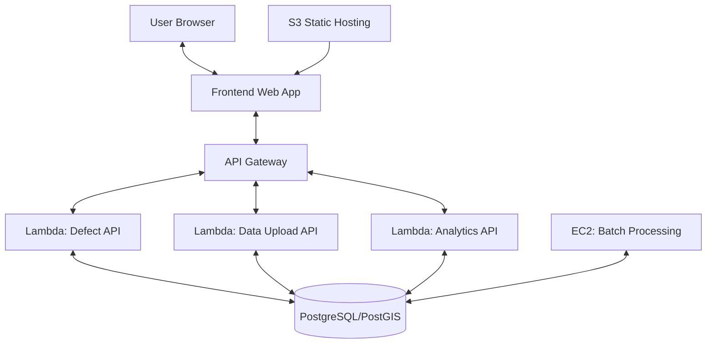

# Road Metrics AI - System Design Document

## 1. Introduction

### 1.1 Purpose
This document outlines the system design for Road Metrics AI, a platform that provides AI-driven road condition assessment and management solutions using smartphone video data, computer vision, and GIS integrations.

### 1.2 Scope
The system allows users to:
- View an interactive map of road defects
- Report new defects by clicking on the map
- View analytics and statistics about road conditions
- Upload external road condition data through an API

### 1.3 Technologies
- **Frontend**: React, TypeScript, Mapbox GL, Chart.js
- **Backend**: Python, FastAPI, SQLAlchemy, GeoAlchemy2
- **Database**: PostgreSQL with PostGIS extension
- **Cloud**: AWS (Lambda, API Gateway, S3, EC2, RDS)
- **CI/CD**: GitHub Actions

## 2. System Architecture

### 2.1 High-Level Architecture



### 2.2 Component Description

#### 2.2.1 Frontend Application
- Single Page Application (SPA) built with React and TypeScript
- Interactive map using Mapbox GL for visualizing and reporting defects
- Dashboard with charts and statistics for data visualization
- Responsive design that works across devices
- Component-level lazy loading for performance optimization

#### 2.2.2 Backend Services
- RESTful API built with FastAPI running on AWS Lambda
- Serverless architecture for cost efficiency and automatic scaling
- Database access through SQLAlchemy ORM
- Geospatial functionality using GeoAlchemy2 and PostGIS
- Authentication and authorization using JWT tokens

#### 2.2.3 Database
- PostgreSQL with PostGIS extension for geospatial data
- Tables for defects, users, and related entities
- Spatial indexing for efficient geographic queries
- Running on AWS RDS for managed database service

#### 2.2.4 Batch Processing
- EC2 instance for scheduled batch jobs
- Data aggregation and report generation
- Periodic maintenance tasks
- Advanced analytics processing

## 3. Data Model

### 3.1 Entity Relationship Diagram

```
+----------------+       +----------------+
|     User       |       |     Defect     |
+----------------+       +----------------+
| id             |       | id             |
| email          |       | defect_type    |
| hashed_password|       | severity       |
| full_name      |       | latitude       |
| is_active      |       | longitude      |
| is_admin       |       | location (geo) |
| created_at     |<----->| notes          |
| updated_at     |       | reported_at    |
+----------------+       | updated_at     |
                         | reported_by    |
                         +----------------+
```

### 3.2 Database Schema

#### Users Table
```sql
CREATE TABLE users (
    id SERIAL PRIMARY KEY,
    email VARCHAR(255) UNIQUE NOT NULL,
    hashed_password VARCHAR(255) NOT NULL,
    full_name VARCHAR(255),
    is_active BOOLEAN DEFAULT TRUE,
    is_admin BOOLEAN DEFAULT FALSE,
    created_at TIMESTAMP WITH TIME ZONE DEFAULT NOW(),
    updated_at TIMESTAMP WITH TIME ZONE
);
```

#### Defects Table
```sql
CREATE TABLE defects (
    id SERIAL PRIMARY KEY,
    defect_type VARCHAR(50) NOT NULL,
    severity VARCHAR(50) NOT NULL,
    latitude FLOAT NOT NULL,
    longitude FLOAT NOT NULL,
    location GEOGRAPHY(POINT, 4326) NOT NULL,
    notes TEXT,
    reported_at TIMESTAMP WITH TIME ZONE DEFAULT NOW(),
    updated_at TIMESTAMP WITH TIME ZONE,
    reported_by INTEGER REFERENCES users(id)
);

-- Create spatial index
CREATE INDEX defects_location_idx ON defects USING GIST (location);
```

## 4. API Design

### 4.1 Endpoints

#### Authentication
- `POST /api/auth/token` - Get access token

#### Defects
- `GET /api/defects` - List all defects
- `POST /api/defects` - Create a new defect
- `GET /api/defects/{defect_id}` - Get a specific defect
- `PUT /api/defects/{defect_id}` - Update a defect
- `DELETE /api/defects/{defect_id}` - Delete a defect
- `POST /api/defects/upload` - Upload external defect data
- `GET /api/defects/statistics/summary` - Get defect statistics

#### Users
- `GET /api/users` - List all users
- `POST /api/users` - Create a new user
- `GET /api/users/{user_id}` - Get a specific user
- `PUT /api/users/{user_id}` - Update a user
- `DELETE /api/users/{user_id}` - Delete a user

## 5. Performance and Scalability

### 5.1 Performance Optimizations

#### Frontend
- Component-level lazy loading
- Debounced API requests for map interactions
- Optimized rendering with React.memo and useMemo
- Compressed images and assets

#### Backend
- Serverless architecture for automatic scaling
- Database connection pooling
- Response caching for frequently accessed data
- Spatial indexing for geographic queries

#### Database
- Proper indexing for common query patterns
- PostGIS spatial indexing
- Query optimization and monitoring

### 5.2 Scalability Considerations

#### Horizontal Scaling
- AWS Lambda automatically scales based on demand
- Database read replicas for scaling read operations
- Stateless API design for easy horizontal scaling

#### Vertical Scaling
- Database instance sizing based on workload
- EC2 instance type selection for batch processing

## 6. Security

### 6.1 Authentication and Authorization
- JWT-based token authentication
- Role-based access control
- Password hashing using bcrypt
- Token expiration and refresh mechanism

### 6.2 Data Security
- HTTPS for all communications
- Database encryption at rest
- Environment-based secrets management
- Input validation and sanitization

### 6.3 Infrastructure Security
- AWS IAM roles with least privilege principle
- Security groups for network access control
- Regular security updates and patches
- Logging and monitoring for security events

## 7. Deployment and CI/CD

### 7.1 Deployment Strategy
- Infrastructure as Code using Terraform
- Separate environments for development, staging, and production
- Blue-green deployment for zero-downtime updates
- Automated rollback on deployment failures

### 7.2 CI/CD Pipeline
- GitHub Actions for automated testing and deployment
- Test coverage requirements for all pull requests
- Automated linting and code quality checks
- Deployment approval process for production

## 8. Monitoring and Observability

### 8.1 Logging
- Structured logging with contextual information
- Centralized log storage and analysis
- Log retention policies

### 8.2 Metrics
- API response times and error rates
- Database performance metrics
- Lambda execution metrics
- User activity metrics

### 8.3 Alerting
- Automated alerts for critical errors
- Performance degradation alerts
- Infrastructure health monitoring
- On-call rotation for incident response

## 9. Future Enhancements

### 9.1 Technical Improvements
- Implement GraphQL for more flexible API queries
- Add WebSocket support for real-time updates
- Expand batch processing capabilities
- Enhance geospatial analysis features

### 9.2 Feature Roadmap
- Mobile applications for Android and iOS
- Integration with vehicle dashcams
- Machine learning for automatic defect detection
- Advanced analytics and prediction models
- Integration with municipal work order systems 